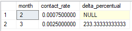
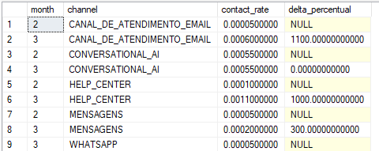
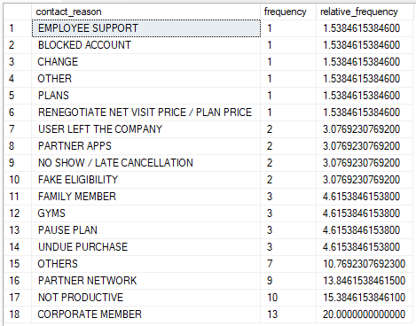
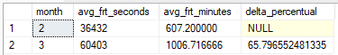
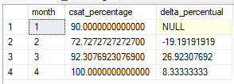

# CX Analytics - Business Case


## Project background

The project revolves around a **wellness app** that helps users track their **fitness, nutrition, and sleep**, serving 2 million active users. Recently, the company has experienced a **higher-than-expected increase in customer support contacts**. The increase in support contacts has raised concerns, and the company seeks to understand the underlying causes of this rise. With key metrics such as **Contact Rate, Contact Reason, Full Resolution Time (FRT), and Customer Satisfaction (CSAT)**, the company aims to analyze user support trends and find actionable insights to address the issue and improve customer satisfaction.

## Objective:

The objective of this project is to **analyze customer support data** from a wellness app, focusing on understanding the recent **increase in support contacts** and its impact on key metrics. The goal is to identify the **root causes** of these changes and provide insights that can guide decision-making and corrective actions.

### Key tasks include:

- Analyzing trends in support tickets, including the contact rate and contact reasons across multiple channels (email, in-app chat, help center).

- Investigating the decline in Customer Satisfaction (CSAT) scores and the decrease in Full Resolution Time (FRT).

- Using SQL to query the data and extract relevant insights that explain the observed changes.

- Providing actionable insights to support decision-making, helping the company address the underlying issues and improve the overall support experience.

- This analysis will be carried out by crafting SQL queries to retrieve the necessary data and provide the company with the required insights to make informed decisions.

## Assumptions

- As stated in the case description, there are no definitive correct results when considering the numerical perspective. This is evident upon reviewing the data, as only March contact data is present in the [table](Case/tabela_cx_contacts.xlsx).

- No specific software limitations were imposed for the analysis.

- The **CSAT (Customer Satisfaction)** metric was calculated using the standard industry methodology, where ratings of **4 and 5** are considered as promoters.

## Data Structure

The data was provided in **two `xlsx` files**, each containing structured information for analysis. Below is a detailed description of each table and its respective variables:

**Table 1 - tabela_cx_contacts**

The dataset consists of **50 rows**, with **each row representing an individual support ticket**. It contains detailed information about **each ticket across all channels, including the contact reason, resolution time, and client identification.**

| **Field Name**                     | **Description**                                                              |
| ---------------------------------- | ---------------------------------------------------------------------------- |
| ticket_id                          | Unique identifier for each support ticket.                                   |
| flt_ctc_created_at                 | Timestamp indicating when the ticket was created.                            |
| flt_ctc_channel_opened             | Channel through which the support ticket was opened (e.g., email, chat).     |
| contact_reason                     | The reason for the support contact (e.g., technical issue, feature inquiry). |
| flt_ctc_status                     | Current status of the ticket (e.g., open, resolved, closed).                 |
| flt_ctc_resolution_time_in_seconds | Time taken to resolve the ticket, in seconds.                                |
| flt_ctc_agent_work_time_in_seconds | Time spent by the agent working on the ticket, in seconds.                   |
| flt_ctc_latest_group_name          | The name of the group or team handling the ticket.                           |
| gympass_id                         | Identifier for the user associated with the support ticket.                  |

**Table 2 - tabale_CSAT_teste (1)**

The dataset consists of **50 rows**, with each row **representing a customer satisfaction (CSAT) record**. It includes **ticket id, contact reason, CSAT Score and CSAT reason**, providing a comprehensive view of our customer experience.

| **Field Name**     | **Description**                                                               |
| ------------------ | ----------------------------------------------------------------------------- |
| flt_ctc_created_at | Timestamp indicating when the support ticket was created.                     |
| Pais               | The country where the support ticket originated (e.g., Brazil).               |
| ticket_id          | Unique identifier for each support ticket.                                    |
| first_group        | The initial group handling the ticket.                                        |
| last_group         | The group that handled the ticket at its conclusion.                          |
| contact_reason     | The reason for the support contact (e.g., EMPLOYEE SUPPORT, OTHER).           |
| CSAT               | The customer satisfaction rating provided (1-5 scale).                        |
| csat_reason        | The reason for the CSAT rating (e.g., agent friendliness, solution speed).    |
| FRT_12HR           | Whether the ticket was eligible for a 12-hour resolution target (True/False). |
| elegibilty         | The type of eligibility (e.g., "titular").                                    |
| last_agent         | The identifier for the last agent who worked on the ticket.                   |
| gympass_id         | Unique identifier for the user associated with the support ticket.            |

## Development

For the development of this project, we used the provided **`xlsx`** files, which were imported and formatted into **`SQL Server Management Studio (SSMS)`**. In this environment, we structured and manipulated the data to generate the requested metrics.

The focus of this case lies in the question: "In order to make decisions and take action, what would be the corresponding **`SQL` code** to pull the data showing the changes we’re observing?". Therefore, our objective is to develop **`SQL` queries** that allow us to monitor variations in the following metrics:

- **Contact Rate**: Number of support tickets/subscribers per month (total and by channel).
- **Contact Reason**: Categories like technical issues, feature questions, account problems, cancellation requests.
- **Full Resolution Time (FRT)**: Average time to resolve a ticket.
- **Customer Satisfaction (CSAT)**: Measured via post-support surveys.

### Contact Rate

This metric represents the number of support tickets raised per subscriber each month, both in total and segmented by channel. It is calculated by dividing the total number of support tickets by the total number of subscribers, then measuring this for each month. A high contact rate can indicate that customers are facing frequent issues, while a low rate might suggest a lack of engagement or unresolved issues. Analyzing this metric by channel can reveal which communication methods are most effective for users.

To track this indicator, we can use the query below.

```sql
WITH ContactRates AS (
    SELECT
        MONTH(CX_Contacts.flt_ctc_created_at) AS month,
        CAST(COUNT(CX_Contacts.ticket_id) AS DECIMAL(10, 2)) / 2000000 * 100 AS contact_rate
    FROM
        CX_Contacts
    GROUP BY
        MONTH(CX_Contacts.flt_ctc_created_at)
)
SELECT
    month,
    contact_rate,
    CASE
        WHEN LAG(contact_rate) OVER (ORDER BY month) = 0 THEN NULL
        ELSE (contact_rate - LAG(contact_rate) OVER (ORDER BY month)) / LAG(contact_rate) OVER (ORDER BY month) * 100
    END AS delta_percentual
FROM
    ContactRates
ORDER BY
    month;
```

The expected result is something similar to the table below.



We can also check how our contact rate is being analyzed by channels. To do this, we use the query below.

```sql
WITH ContactRates AS (
    SELECT
        MONTH(CX_Contacts.flt_ctc_created_at) AS month,
        CX_Contacts.flt_ctc_channel_opened as channel,
        CAST(COUNT(CX_Contacts.ticket_id) AS DECIMAL(10, 2)) / 2000000 * 100 AS contact_rate
    FROM
        CX_Contacts
    GROUP BY
        MONTH(CX_Contacts.flt_ctc_created_at),
        CX_Contacts.flt_ctc_channel_opened
)
SELECT
    month,
    channel,
    contact_rate,
    CASE
        WHEN LAG(contact_rate) OVER (PARTITION BY channel ORDER BY month) = 0 THEN NULL
        ELSE (contact_rate - LAG(contact_rate) OVER (PARTITION BY channel ORDER BY month)) / LAG(contact_rate) OVER (PARTITION BY channel ORDER BY month) * 100
    END AS delta_percentual
FROM
    ContactRates
ORDER BY
    channel, month;
```

The expected result is something similar to the table below.



### Contact Reason

This categorizes the primary reasons customers reach out for support, such as technical issues, feature inquiries, account problems, or cancellation requests. By categorizing tickets, we can gain a deeper understanding of what drives customer interactions. For example, a spike in technical issues may suggest the need for product improvement, while a rise in cancellation requests could indicate dissatisfaction or competition.

To track this indicator, we can use the query below.

```sql
SELECT
    CX_Contacts.contact_reason,
    COUNT(CX_Contacts.ticket_id) AS total_contacts,
    CAST(COUNT(CX_Contacts.ticket_id) AS DECIMAL(10, 2)) /
    (SELECT COUNT(*) FROM CX_Contacts) * 100 AS percentage_of_total
FROM
    CX_Contacts
GROUP BY
    CX_Contacts.contact_reason;
```

The expected result is something similar to the table below.



### Full Resolution Time (FRT)

This metric calculates the average time taken to resolve a support ticket. It is calculated by summing the resolution times for all tickets in a given period and dividing by the total number of tickets. A longer resolution time might indicate inefficiencies in the support process, while a shorter resolution time typically reflects a well-optimized support system. Analyzing trends in FRT can help identify bottlenecks or areas for improvement in the support workflow.

To track this indicator, we can use the query below.

```sql
WITH FRTData AS (
    SELECT
        MONTH(CX_Contacts.flt_ctc_created_at) AS month,
        AVG(CX_Contacts.flt_ctc_resolution_time_in_seconds) AS avg_frt_seconds
    FROM
        CX_Contacts
    GROUP BY
        MONTH(CX_Contacts.flt_ctc_created_at)
)
SELECT
    month,
    avg_frt_seconds,

    CAST(avg_frt_seconds AS DECIMAL(10, 2)) / 60 AS avg_frt_minutes,
    CASE
        WHEN LAG(avg_frt_seconds) OVER (ORDER BY month) IS NULL THEN NULL
        WHEN LAG(avg_frt_seconds) OVER (ORDER BY month) = 0 THEN NULL
        ELSE
            (avg_frt_seconds - LAG(avg_frt_seconds) OVER (ORDER BY month)) * 100.0 / LAG(avg_frt_seconds) OVER (ORDER BY month)
    END AS delta_percentual
FROM
    FRTData
ORDER BY
    month;
```

The expected result is something similar to the table below.



### Customer Satisfaction (CSAT)

This metric is derived from post-support surveys where customers rate their satisfaction with the support experience. Typically measured on a scale from 1 to 5, the CSAT score helps assess overall customer sentiment. Low CSAT scores may highlight dissatisfaction, often linked to slow resolution times or poor agent interactions. Monitoring CSAT regularly can provide insights into customer perceptions of service quality and highlight areas for improvement.

To track this indicator, we can use the query below.

```sql
WITH CSATData AS (
    SELECT
        MONTH(CSAT_ans.flt_ctc_created_at) AS month,
        COUNT(CSAT_ans.ticket_id) AS total_responses,
        COUNT(CASE WHEN CSAT_ans.CSAT IN (4, 5) THEN 1 END) AS positive_responses
    FROM
        CSAT_ans
    GROUP BY
        MONTH(CSAT_ans.flt_ctc_created_at)
)
SELECT
    month,
    CAST(positive_responses AS DECIMAL(10, 2)) / total_responses * 100 AS csat_percentage,
    CASE
        WHEN LAG(CAST(positive_responses AS DECIMAL(10, 2)) / total_responses * 100) OVER (ORDER BY month) = 0 THEN NULL
        ELSE (CAST(positive_responses AS DECIMAL(10, 2)) / total_responses * 100 -
              LAG(CAST(positive_responses AS DECIMAL(10, 2)) / total_responses * 100) OVER (ORDER BY month)) /
             LAG(CAST(positive_responses AS DECIMAL(10, 2)) / total_responses * 100) OVER (ORDER BY month) * 100
    END AS delta_percentual
FROM
    CSATData
ORDER BY
    month;
```

The expected result is something similar to the table below.


